# hackgr1d-team7

## Um chatbot no Whatsapp que auxilia na qualificação de leads, cross selling, remarketing e renovação de seguro.

## Linguagem:
Foi utilizado a linguagem Flask juntamente com a plataforma Twilio para desenvolver o chatbot.

## Lógica de negócio

- Ao obter os dados dos clientes no chatbot adicionamos esses dados a um banco de dados. Assim conseguimos gerar dados sobre os nossos clientes, assim como mapas de calor que indicam a localização de mais leads e suas demandas.

## APIs

- A partir dos dados obtidos dos clientes nas conversas com o chatbot aplicamos esses dados a API Procob da Gr1d para validação desses dados e obtenção de mais informações sobre os clientes. Consequentemente estamos gerando leads mais qualificados para os nossos seguradores. 

- Utilizamos a API da Aegon seguros para ....

## Imagens no chatbot 

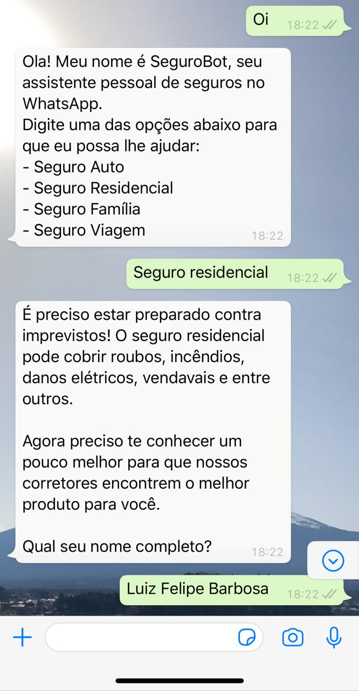</img>

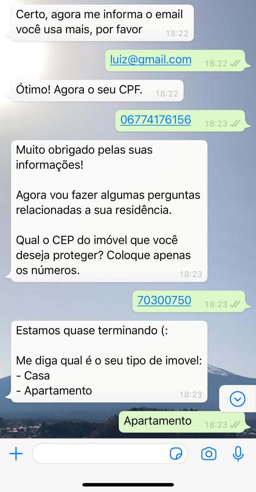</img>

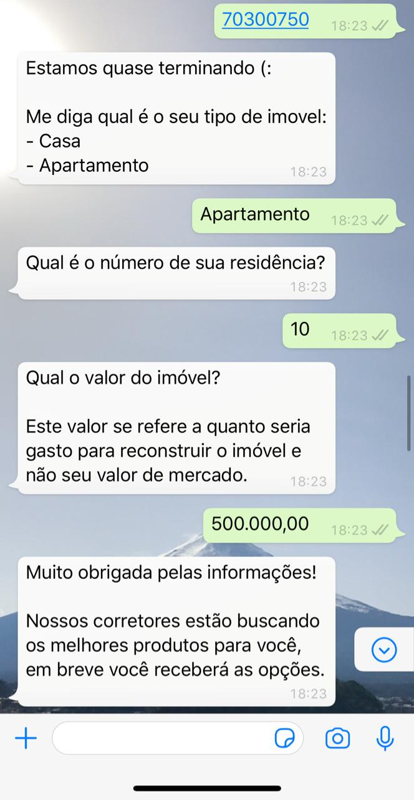</img>

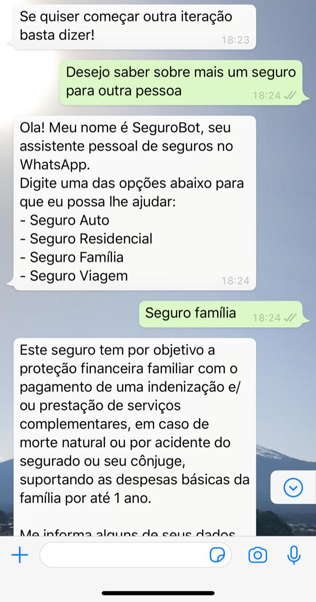</img>

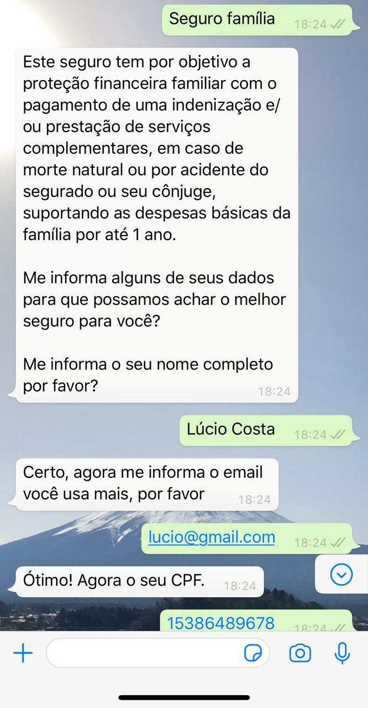</img>

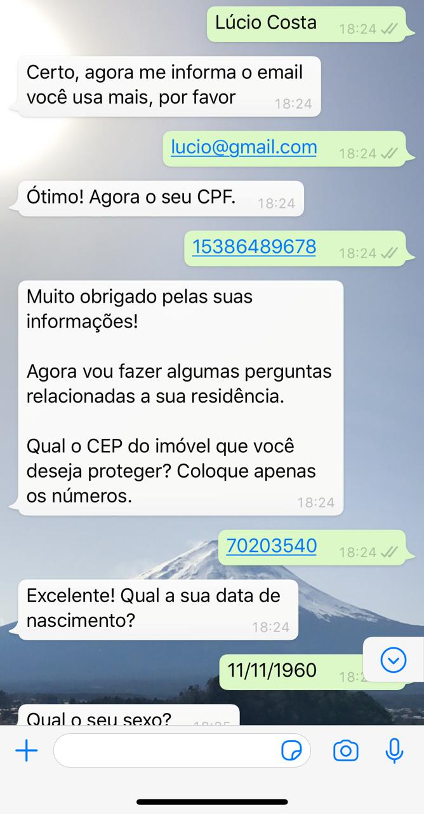</img>

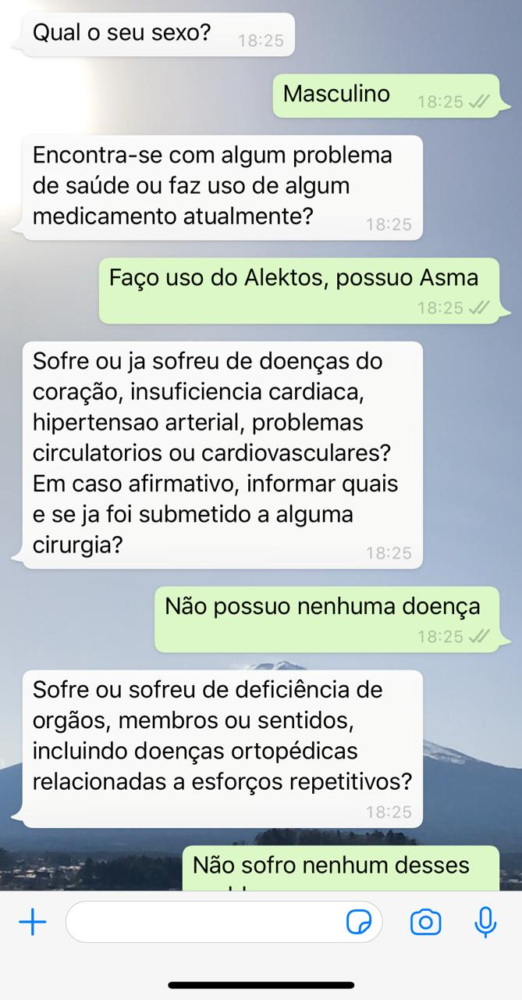</img>

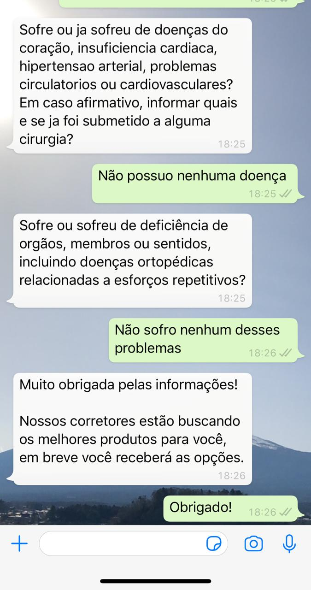</img>

## Banco de dados

Abaixo algumas fotos do banco de dados para armazenar as informações dos usuários.

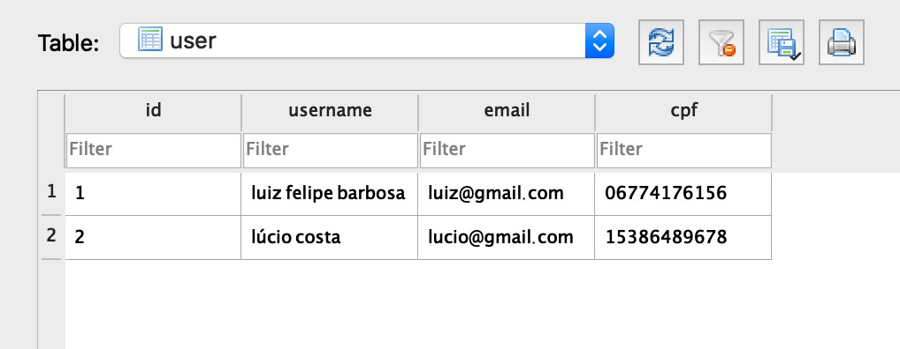</img>

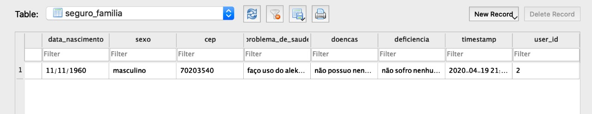</img>

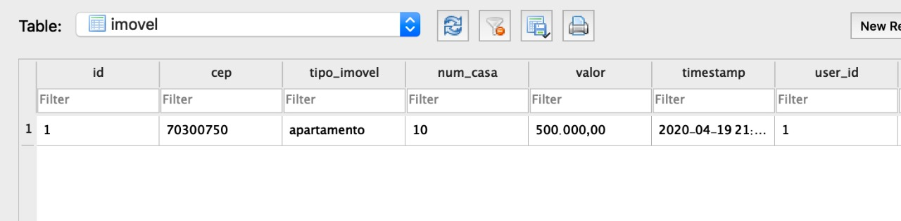</img>

## Tutoriais 

- https://www.twilio.com/blog/how-run-flask-application
- https://www.twilio.com/blog/build-a-whatsapp-chatbot-with-python-flask-and-twilio
- https://www.twilio.com/blog/build-soccer-stats-whatsapp-chatbot-python-flask-twilio
- https://www.twilio.com/blog/detect-toxic-language-in-twilio-chat-with-tensorflow-js